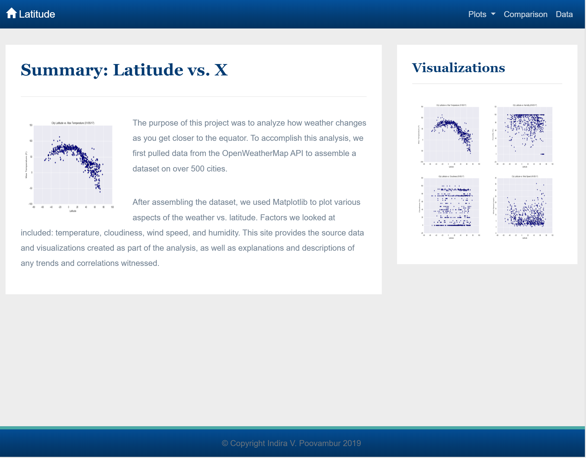
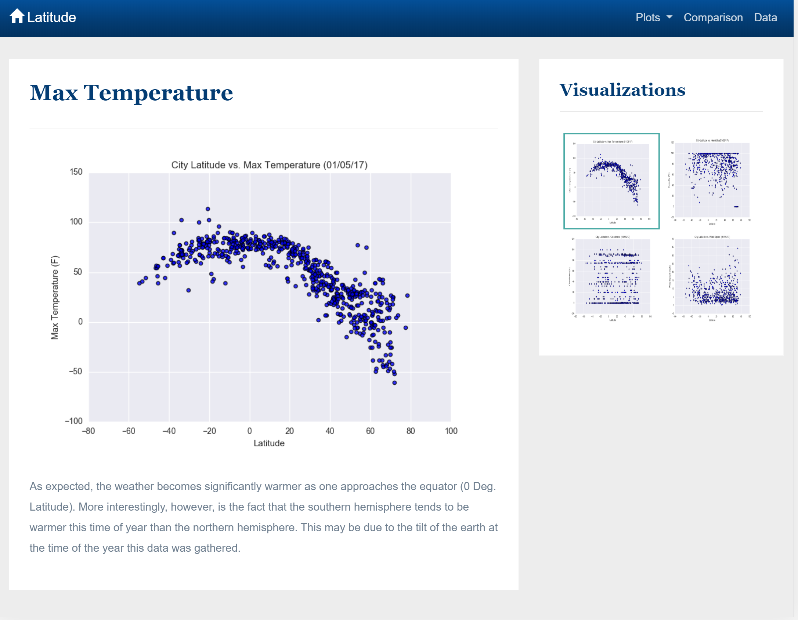
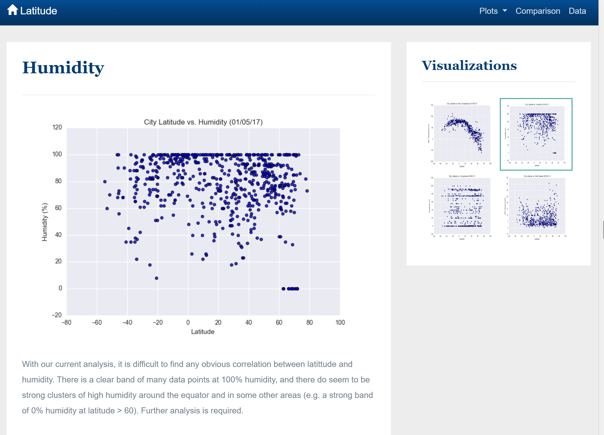
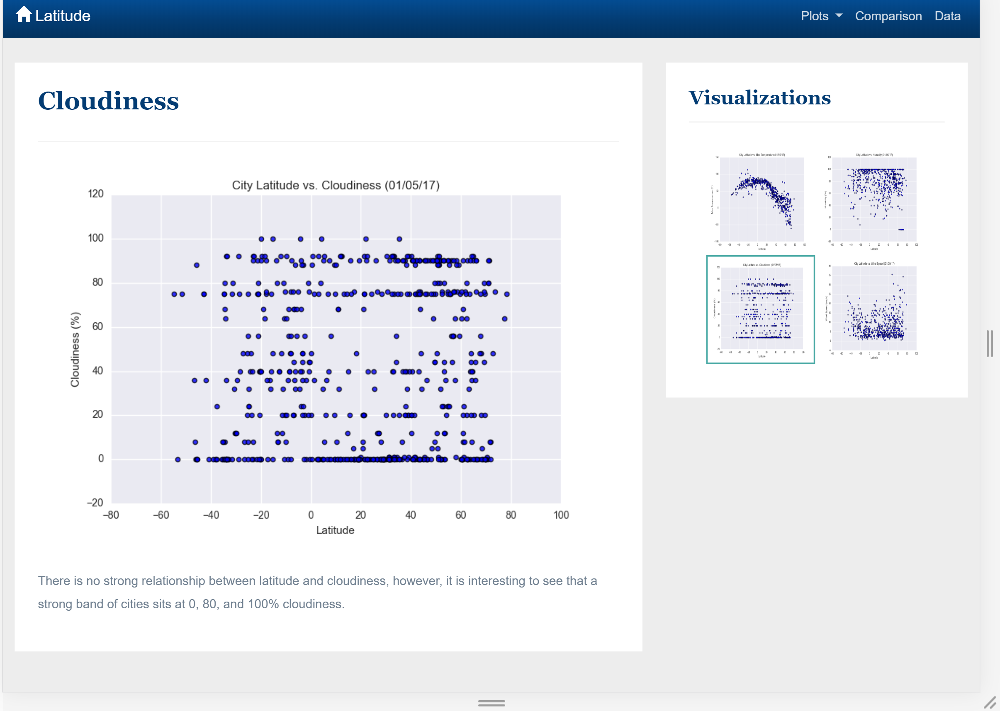
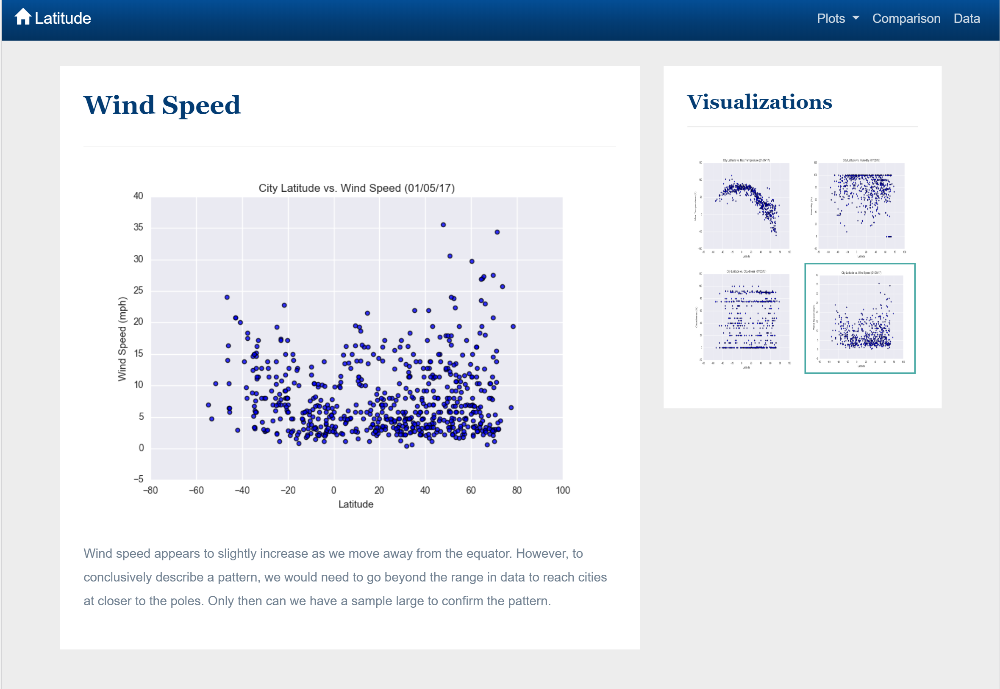
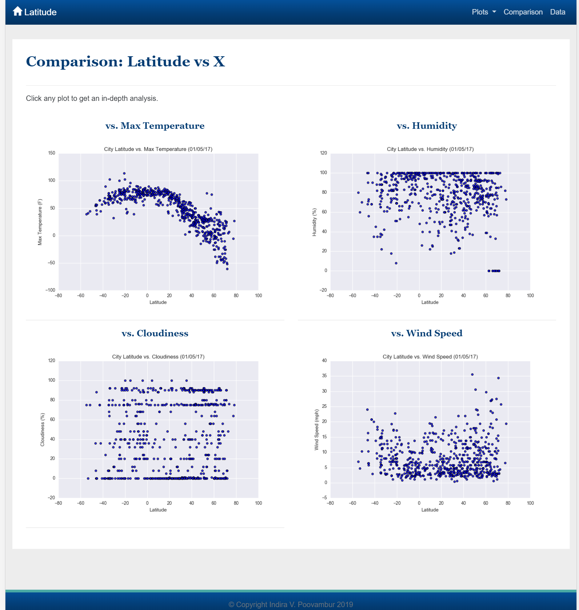
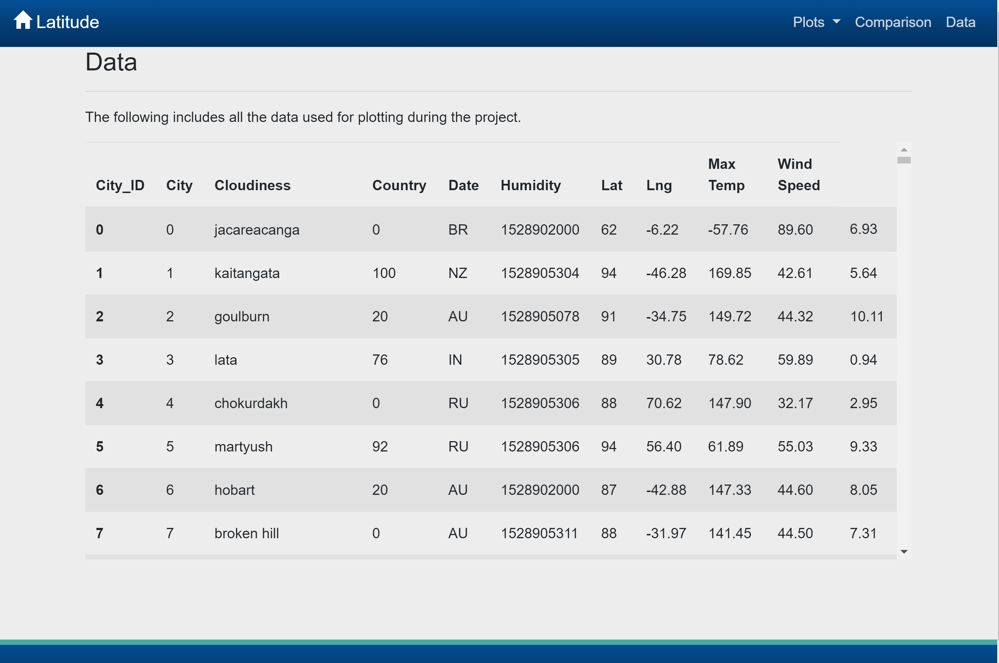

# Responsive Visualization-Dashboard using BootStrap 4.3, HTML5 and CSS3
## Latitude - Latitude Analysis Dashboard
## [demo](https://indirapv.github.io/Responsive-Visualization-Dashboard/)

A dashboard website using visualizations(by plotting weather data) was created.
In building this dashboard, individual pages was created for each plot with means to navigate between them. These pages contain the visualizations and their corresponding explanations. There is also a landing/home page, a comparison page and a data page.

* Landing/Home page 
This contains an explanation of the dashboard and links to each visualizations page.

* Four visualization pages
Each contains:
	* A descriptive title and heading tag.
	* The plot/visualization itself for the selected comparison.
	* A paragraph describing the plot and its significance.

* A "Comparisons" page 
This contains all of the visualizations on the same page so we can easily, visually compare them.
Uses a bootstrap grid for the visualizations.

* A "Data" page 
This displays a responsive table containing the data used in the visualizations.
The table is a bootstrap component.
The data comes from exporting a csv file to a dataframe and generating HTML table from it using Pandas' nifty method appropriately called to_html. 

The website has, at the top of every page, a navigation menu that has the name of the site on the left which allows users to return to the landing page from any page.
Contains a dropdown on the right named "Plots" which provides links to each individual visualization page.
Provides two more links on the right: "Comparisons" which links to the comparisons page, and "Data" which links to the data page.
Navigation menu is responsive(media queries). 

