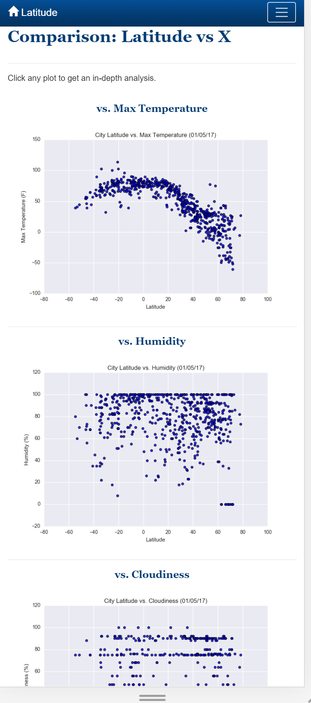
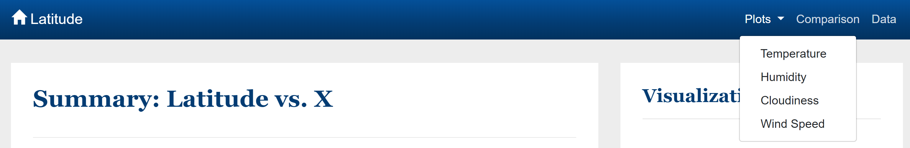

# Responsive Visualization-Dashboard using BootStrap 4.3, HTML5 and CSS

## Latitude - Latitude Analysis Dashboard(https://github.com/IndiraPV/Responsive-Visualization-Dashboard)
For this challenge created a visualization dashboard **website** using visualizations that wad created in a past assignment. Specifically,plotting weather data.
In building this dashboard, individual pages was created for each plot and a means to navigate between them. These pages contain the visualizations and their corresponding explanations. We'll also have a landing page, a page where we can see a comparison of all of the plots, and another page where we can view the data used to build them.

The wesite has the following:
* A landing page containing an explanation of the project and links to each visualizations page.

* Four visualization pages, each with:
	* A descriptive title and heading tag.
	* The plot/visualization itself for the selected comparison.
	* A paragraph describing the plot and its significance.

* A "Comparisons" page that:

Contains all of the visualizations on the same page so we can easily visually compare them.
Uses a bootstrap grid for the visualizations.

The grid must be two visualizations across on screens medium and larger, and 1 across on extra-small and small screens.

Screens medium and larger:

Screens etra-small and small:

* A "Data" page that:

Displays a responsive table containing the data used in the visualizations.
The table must be a bootstrap table component.
The data must come from exporting the .csv file as HTML, or converting it to HTML. Pandas has a nifty method approprately called to_html that allows you to generate a HTML table from a pandas dataframe. 

The website has, at the top of every page, have a navigation menu that:

Has the name of the site on the left of the nav which allows users to return to the landing page from any page.
Contains a dropdown on the right of the navbar named "Plots" which provides links to each individual visualization page.
Provides two more links on the right: "Comparisons" which links to the comparisons page, and "Data" which links to the data page.
Navigation menu is responsive (using media queries). 

Finally, the website was deployed to GitHub pages.

[website](https://indirapv.github.io/Responsive-Visualization-Dashboard/)
